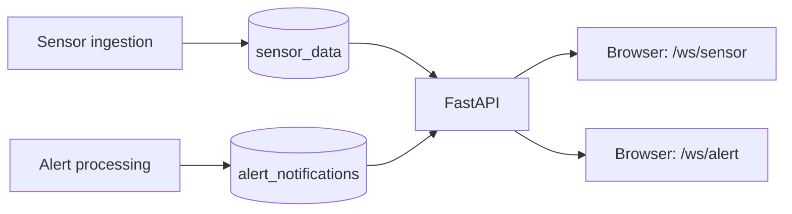

# Factory Tycoon - WebSocket

[한국어](README.md) | **English**

Factory Tycoon is a team project that connects factory operations, IoT sensor monitoring, anomaly detection, and AI analysis. Its repositories cover data collection, backend services, the web interface, and cloud deployment.

**A live gateway delivering Redis sensor data and alerts to browsers.** FastAPI manages two groups of WebSocket connections and routes messages by Redis Pub/Sub channel.

## Data flow



- Separate connection lists route sensor and alert messages to their respective clients.
- Original Redis messages are broadcast as text.
- Redis subscription reads run in an executor; WebSocket delivery is asynchronous.
- After 30 seconds without a client message, the server sends `{"type":"ping"}`.

## Stack

Python 3.11, FastAPI, Uvicorn, redis-py, asyncio, Docker

## Run locally

You need Python 3.11 and a reachable Redis instance.

```bash
python -m venv .venv
source .venv/bin/activate
pip install -r requirements.txt
```

Create `.env` in the repository root.

```dotenv
REDIS_HOST=localhost
REDIS_PORT=6379
REDIS_CHANNEL=sensor_data
REDIS_ALERT_CHANNEL=alert_notifications
WEBSOCKET_HOST=0.0.0.0
WEBSOCKET_PORT=8000
```

Set `REDIS_USERNAME` and `REDIS_PASSWORD` if Redis requires authentication.

```bash
python main.py
```

| Endpoint | Purpose |
| --- | --- |
| `GET /` | Process response (`{"status":"ok"}`); does not verify Redis connectivity |
| `ws://localhost:8000/ws/sensor` | Sensor stream |
| `ws://localhost:8000/ws/alert` | Alert stream |

## Client example

```javascript
const socket = new WebSocket('ws://localhost:8000/ws/sensor');
socket.onmessage = ({ data }) => {
  const message = JSON.parse(data);
  if (message.type === 'ping') return;
  console.log(message);
};
```

Publish a sample message to local Redis to check delivery:

```bash
redis-cli PUBLISH sensor_data '{"device_id":"demo","sensors":[]}'
```

## Run in a container

```bash
docker build -t factory-tycoon-websocket .
docker run --env-file .env -p 8000:8000 factory-tycoon-websocket
```

Set `REDIS_HOST` to an address reachable from the container. The implementation is in [main.py](main.py). This service forwards Pub/Sub messages; it does not store or replay message history.

## Related repositories

| Repository | Role |
| --- | --- |
| [factory-tycoon-frontend](https://github.com/factorytycoon/factory-tycoon-frontend) | Web dashboard and 3D factory visualization |
| [factory-tycoon-backend](https://github.com/factorytycoon/factory-tycoon-backend) | Factory operations and authentication API |
| [factory-tycoon-backend-aws](https://github.com/factorytycoon/factory-tycoon-backend-aws) | Bedrock AI analysis and S3/OpenSearch integration |
| [factory-tycoon-backend-websocket](https://github.com/factorytycoon/factory-tycoon-backend-websocket) | Live sensor and alert delivery |
| [factory-tycoon-sensor-simulator](https://github.com/factorytycoon/factory-tycoon-sensor-simulator) | Simulated sensor data and MQTT publishing |
| [factory-tycoon-opensearch](https://github.com/factorytycoon/factory-tycoon-opensearch) | Anomaly detection and alert configuration assets |
| [factory-tycoon-cloud](https://github.com/factorytycoon/factory-tycoon-cloud) | AWS infrastructure and Lambda with Terraform |
| [factory-tycoon-k8s](https://github.com/factorytycoon/factory-tycoon-k8s) | Helm and Kubernetes deployment configuration |
