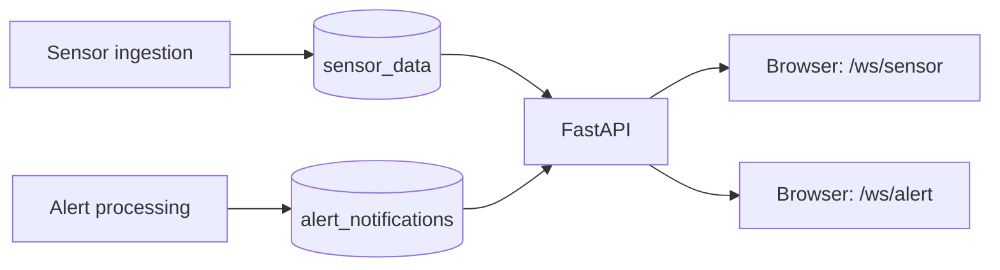

# Factory Tycoon - WebSocket

**한국어** | [English](README.en.md)

Factory Tycoon은 공장 운영 관리, IoT 센서 모니터링, 이상 탐지, AI 분석을 연결하는 스마트 팩토리 팀 프로젝트입니다. 여러 저장소가 데이터 수집부터 웹 화면과 클라우드 배포까지 역할을 나누어 구성합니다.

**Redis에서 받은 센서 데이터와 알람을 브라우저에 전달하는 실시간 게이트웨이입니다.** FastAPI가 두 종류의 WebSocket 연결을 관리하고, Redis Pub/Sub 채널별로 메시지를 전달합니다.

## 데이터 흐름



- 센서와 알람의 연결 목록을 분리해 해당 채널의 메시지만 전송합니다.
- Redis의 원본 메시지를 텍스트로 브로드캐스트합니다.
- Redis 구독 읽기는 executor에서 실행하고, WebSocket 전송은 비동기로 처리합니다.
- 클라이언트 메시지를 30초 동안 받지 않으면 `{"type":"ping"}` 메시지를 전송합니다.

## 기술 스택

Python 3.11, FastAPI, Uvicorn, redis-py, asyncio, Docker

## 로컬 실행

Python 3.11과 접근 가능한 Redis가 필요합니다.

```bash
python -m venv .venv
source .venv/bin/activate
pip install -r requirements.txt
```

저장소 루트에 `.env`를 만듭니다.

```dotenv
REDIS_HOST=localhost
REDIS_PORT=6379
REDIS_CHANNEL=sensor_data
REDIS_ALERT_CHANNEL=alert_notifications
WEBSOCKET_HOST=0.0.0.0
WEBSOCKET_PORT=8000
```

Redis 인증이 필요하면 `REDIS_USERNAME`, `REDIS_PASSWORD`도 설정합니다.

```bash
python main.py
```

| 경로 | 용도 |
| --- | --- |
| `GET /` | 프로세스 응답 확인 (`{"status":"ok"}`), Redis 연결 상태 검증은 아님 |
| `ws://localhost:8000/ws/sensor` | 센서 스트림 |
| `ws://localhost:8000/ws/alert` | 알람 스트림 |

## 연결 예시

```javascript
const socket = new WebSocket('ws://localhost:8000/ws/sensor');
socket.onmessage = ({ data }) => {
  const message = JSON.parse(data);
  if (message.type === 'ping') return;
  console.log(message);
};
```

로컬 Redis에 샘플 메시지를 발행해 전달 경로를 확인할 수 있습니다.

```bash
redis-cli PUBLISH sensor_data '{"device_id":"demo","sensors":[]}'
```

## 컨테이너 실행

```bash
docker build -t factory-tycoon-websocket .
docker run --env-file .env -p 8000:8000 factory-tycoon-websocket
```

컨테이너의 `REDIS_HOST`는 컨테이너에서 접근할 수 있는 주소로 바꿉니다. 구현은 [main.py](main.py)에 있습니다. 이 서비스는 Pub/Sub 메시지를 전달하며, 지난 메시지 저장이나 재생은 제공하지 않습니다.

## 관련 저장소

| 저장소 | 역할 |
| --- | --- |
| [factory-tycoon-frontend](https://github.com/factorytycoon/factory-tycoon-frontend) | 웹 대시보드와 3D 공장 시각화 |
| [factory-tycoon-backend](https://github.com/factorytycoon/factory-tycoon-backend) | 공장 운영 데이터와 인증 API |
| [factory-tycoon-backend-aws](https://github.com/factorytycoon/factory-tycoon-backend-aws) | Bedrock AI 분석과 S3 및 OpenSearch 연동 |
| [factory-tycoon-backend-websocket](https://github.com/factorytycoon/factory-tycoon-backend-websocket) | 센서와 알람 실시간 전송 |
| [factory-tycoon-sensor-simulator](https://github.com/factorytycoon/factory-tycoon-sensor-simulator) | 가상 센서 데이터 생성과 MQTT 전송 |
| [factory-tycoon-opensearch](https://github.com/factorytycoon/factory-tycoon-opensearch) | 이상 탐지와 알람 설정 자료 |
| [factory-tycoon-cloud](https://github.com/factorytycoon/factory-tycoon-cloud) | Terraform 기반 AWS 인프라와 Lambda |
| [factory-tycoon-k8s](https://github.com/factorytycoon/factory-tycoon-k8s) | Helm과 Kubernetes 배포 구성 |
